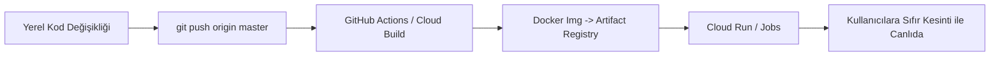

# Chat Conversation

Note: _This is purely the output of the chat conversation and does not contain any raw data, codebase snippets, etc. used to generate the output._

### User Input

Bu projeyi tamamen google cloud üzerinde çalıştırabilir miyim. Maliyetlerim nasıl olur? 

*Listed directory [Yüz_Tanıma_SaaS](file:///home/selahaddin/Belgeler/Y%C3%BCz_Tan%C4%B1ma_SaaS) *

*Viewed [README.md](file:///home/selahaddin/Belgeler/Y%C3%BCz_Tan%C4%B1ma_SaaS/README.md) *

*Viewed [Dockerfile](file:///home/selahaddin/Belgeler/Y%C3%BCz_Tan%C4%B1ma_SaaS/Dockerfile) *

*Viewed [requirements-worker.txt](file:///home/selahaddin/Belgeler/Y%C3%BCz_Tan%C4%B1ma_SaaS/requirements-worker.txt) *

*Viewed [start_all.sh](file:///home/selahaddin/Belgeler/Y%C3%BCz_Tan%C4%B1ma_SaaS/start_all.sh) *

*Listed directory [public](file:///home/selahaddin/Belgeler/Y%C3%BCz_Tan%C4%B1ma_SaaS/public) *

*Listed directory [stitch_event_face_finder_saas](file:///home/selahaddin/Belgeler/Y%C3%BCz_Tan%C4%B1ma_SaaS/stitch_event_face_finder_saas) *

*Viewed [guest_api.py](file:///home/selahaddin/Belgeler/Y%C3%BCz_Tan%C4%B1ma_SaaS/guest_api.py) *

### Planner Response

Evet, bu projeyi **%100 Google Cloud Platform (GCP)** üzerinde çalıştırabilirsiniz. Mevcut mimariniz (FastAPI, Streamlit, InsightFace/ONNXRuntime AI İşçisi, PostgreSQL + `pgvector` ve Nesne Depolama), GCP’nin modern **sunucusuz (Serverless)** servisleriyle birebir ve çok yüksek performansla uyum sağlar.

---

### 1. GCP Mimari Eşleşme Tablosu

Mevcut projenizin bileşenleri GCP üzerinde şu servislerle karşılanır:

| Proje Bileşeni | Mevcut / Önerilen | GCP Karşılığı Servis | Açıklama / Avantajı |
|---|---|---|---|
| **Veritabanı & Vektör Arama** | Supabase (PostgreSQL + `pgvector`) | **Cloud SQL for PostgreSQL** | PostgreSQL 15+ sürümü varsayılan olarak `pgvector` destekler. Mevcut `match_faces` RPC fonksiyonunuz aynen çalışır. |
| **Fotoğraf & Medya Depolama** | Supabase Storage / S3 | **Google Cloud Storage (GCS)** | Sınırsız fotoğraf depolama, yüksek okuma/yazma hızı ve Cloud CDN entegrasyonu. |
| **Web API (`guest_api.py`)** | FastAPI | **Cloud Run** | İstek gelmediğinde sıfıra ölçeklenir (**Scale to 0**), boşta para yazmaz. |
| **Yönetim Paneli (`app.py` / `studio_app.py`)** | Streamlit | **Cloud Run** | Yönetici veya fotoğrafçı panele girdiğinde otomatik uyanır. |
| **AI Yüz İşleme Worker (`worker.py`)** | Python / InsightFace | **Cloud Run Jobs** VEYA **Compute Engine (Spot GPU)** | Fotoğraf yüklendiğinde tetiklenip AI analizi yapar, iş bitince kendini kapatır. |
| **Ön Yüz / Statik Dosyalar (`public/`)** | HTML/JS / Vercel | **Firebase Hosting** / **Cloud Run** | Ücretsiz/çok düşük maliyetle küresel CDN üzerinden sunulur. |

---

### 2. Detaylı Maliyet Analizi (3 Farklı Ölçek Senaryosu)

Maliyetler sistemin **kullanım yoğunluğuna, yüklenen fotoğraf sayısına ve depolama miktarına** göre değişir. GCP'nin "kullandığın kadar öde" (Pay-as-you-go) modeli sayesinde başlangıçta maliyetler oldukça düşüktür.

#### 🟢 Senaryo 1: Başlangıç / MVP (Aylık 5-15 Etkinlik, ~10.000 Fotoğraf, 100 GB Depolama)
*Bu aşamada GCP'nin aylık ücretsiz kullanım kotaları (Free Tier) maliyeti ciddi oranda düşürür.*

- **Cloud SQL (PostgreSQL - `db-f1-micro` / `db-g1-small`):** ~$7 - $15 / ay
- **Cloud Storage (100 GB Fotoğraf):** ~$2.30 / ay
- **Cloud Run (FastAPI + Streamlit - Düşük Trafik):** ~$0 - $3 / ay (Ücretsiz kota dahilinde)
- **Cloud Run Jobs (AI Yüz Analiz Worker - CPU):** ~$3 - $8 / ay (Sadece yükleme yapıldığında çalışır)
- **Ağ Transferi (Egress):** ~$1 - $2 / ay
- **💰 Toplam Tahmini Maliyet: ~$13 – $28 / ay**

---

#### 🟡 Senaryo 2: Orta Ölçek SaaS (Aylık 50-100 Etkinlik, ~100.000 Fotoğraf, 1 TB Depolama)

- **Cloud SQL (2 vCPU, 8 GB RAM - Yüksek performanslı pgvector):** ~$50 - $75 / ay
- **Cloud Storage (1 TB Fotoğraf + Görsel Çıktılar):** ~$23 / ay
- **Cloud Run (Web API & Studio Panel):** ~$15 - $30 / ay
- **Cloud Run Jobs (AI Worker - CPU 4 Core):** ~$25 - $45 / ay
- **Cloud CDN & Ağ Transferi:** ~$15 - $25 / ay
- **💰 Toplam Tahmini Maliyet: ~$128 – $198 / ay**

---

#### 🔴 Senaryo 3: Yüksek Ölçek (Aylık 500+ Düğün/Etkinlik, ~1.000.000 Fotoğraf, 10 TB Depolama, GPU Hızlandırma)

- **Cloud SQL / AlloyDB (4-8 vCPU, 32 GB RAM):** ~$180 - $280 / ay
- **Cloud Storage (10 TB Fotoğraf):** ~$230 / ay
- **Cloud Run (Yüksek Trafikli API & CDN):** ~$60 - $120 / ay
- **Compute Engine Spot VM (NVIDIA T4 / L4 GPU) / Cloud Run GPU:** ~$100 - $200 / ay *(Binlerce fotoğrafı saniyeler içinde işlemek için GPU kullanılır)*
- **Cloud CDN & Trafik:** ~$80 - $150 / ay
- **💰 Toplam Tahmini Maliyet: ~$650 – $980 / ay**

---

### 3. Google Cloud'da Maliyeti Düşürmek İçin En İyi Stratejiler

1. **Cloud Run "Scale-to-Zero" (Sıfıra Ölçekleme):**
   Geceleri veya etkinlik olmayan günlerde API ve Streamlit sunucularınız çalışmaz, 0 CPU harcar ve **0 TL** fatura kesilir.
2. **Cloud Run Jobs ile Paralel AI İşleme:**
   Fotoğraflar yüklendiğinde `worker.py` scriptini **Cloud Run Job** olarak başlatabilirsiniz. Örneğin 1.000 fotoğraf yüklendiğinde 10 adet container aynı anda açılır, tüm fotoğrafları 30 saniyede işler ve iş bitince hepsi kapanır. Sadece o 30 saniyelik CPU/RAM süresini ödersiniz.
3. **CPU vs GPU Tercihi (InsightFace ONNX optimization):**
   InsightFace modeli ONNXRuntime CPU (AVX-512) üzerinde resim başına ~100-200ms civarında çalışır. Başlangıç seviyesinde GPU sunucusu kiralamak yerine Cloud Run CPU kullanmak maliyeti %80 düşürür.
4. **Cloud Storage Yaşam Döngüsü (Lifecycle Rules):**
   Biten veya eskiyen etkinlik fotoğraflarını 30 gün sonra otomatik olarak **Nearline** veya **Coldline** depolama sınıfına aktararak depolama maliyetini GB başına $0.023'ten $0.010 veya $0.004'e indirebilirsiniz.

---

### 🚀 Özet ve Tavsiye

Projeyi tamamen GCP üzerinde çalıştırmak hem mimari açıdan **çok kolay** hem de ölçeklenebilirlik açısından **en profesyonel çözümdür**. 

**İlk Adım Önerisi:**
Projenizi denemek ve canlıya almak için **Senaryo 1 (Cloud Run + Cloud SQL + GCS)** altyapısıyla başlayabilirsiniz. Aylık **$15-$25** gibi çok makul bir bütçeyle tam teşekküllü, otomatik ölçeklenen bir Yüz Tanıma SaaS sistemine sahip olabilirsiniz.

### User Input

eğer google cloud 'a taşırsam projeyi güncelleme ve hata yönetim gibi süreçleri nasıl yönetebilirim. 

*Viewed [githuba_guncelle.sh](file:///home/selahaddin/Belgeler/Y%C3%BCz_Tan%C4%B1ma_SaaS/githuba_guncelle.sh) *

### Planner Response

Google Cloud (GCP) altyapısına geçtiğinizde, **güncelleme (dağıtım/deployment)** ve **hata yönetimi (monitoring/logging)** süreçleriniz geleneksel sunuculara veya tekli hosting hizmetlerine kıyasla çok daha otomatik, güvenli ve profesyonel hale gelir.

Mevcut projenize özel bu süreçleri nasıl yöneteceğinizin detaylı rehberi aşağıdadır:

---

### 1. Güncelleme Süreçleri (CI/CD & Zero-Downtime Deployment)

Google Cloud'da yeni bir özellik eklediğinizde veya hata düzelttiğinizde sistemi güncellemek tamamen otomatikleşir:



#### A. Tam Otomatik Dağıtım (GitHub Integration)
1. Siz şu anki gibi `githuba_guncelle.sh` betiğinizle koda `git push` yaptığınızda, GCP **Cloud Build** veya **GitHub Actions** bunu otomatik algılar.
2. `Dockerfile` dosyanız GCP üzerinde saniyeler içinde derlenir.
3. Yeni container görseli **Cloud Run** servislerinize (API, Streamlit veya Worker) otomatik dağıtılır.

#### B. Kesintisiz Güncelleme (Zero-Downtime Deployment)
- Cloud Run, yeni güncellemenizi yüklerken eski sürümü kapatmaz.
- Yeni sürümün sağlıklı bir şekilde ayağa kalktığını (Health Check) doğruladıktan sonra gelen trafiği yumuşak bir şekilde yeni sürüme aktarır. 
- **Sonuç:** Fotoğraf yükleyen veya yüz araması yapan ziyaretçiler güncelleme esnasında **hiçbir kesinti veya 502 hatası yaşamaz**.

#### C. Anında Eski Sürüme Dönüş (Instant Rollback)
- Eğer canlıya attığınız yeni kodda bir mantık hatası veya çökme yaşanırsa, Google Cloud Console paneli üzerinden tek bir tıkla veya komutla **1 saniyede** bir önceki çalışan sürüme geri dönebilirsiniz (`Revision Rollback`).

---

### 2. Hata Yönetimi & İzleme (Logging, Error Reporting & Alerts)

Google Cloud, uygulamanızın sağlık durumunu izlemek için dahili olarak **Google Cloud Operations Suite** araçlarını sunar:

```
                  ┌────────────────────────────────────────┐
                  │        Uygulama (Python / AI)          │
                  └──────────────────┬─────────────────────┘
                                     │
                 ┌───────────────────┼───────────────────┐
                 ▼                   ▼                   ▼
        ┌─────────────────┐ ┌─────────────────┐ ┌─────────────────┐
        │  Cloud Logging  │ │ Error Reporting │ │ Cloud Monitoring│
        │ (Tüm Log/Çıktı) │ │ (Çökmeleri Yakal│ │ (CPU/RAM/Grafik)│
        └────────┬────────┘ └────────┬────────┘ └────────┬────────┘
                 │                   │                   │
                 └───────────────────┼───────────────────┘
                                     ▼
                      ┌─────────────────────────────┐
                      │ Telegram / Slack / E-Posta  │
                      │       Anlık Bildirim        │
                      └─────────────────────────────┘
```

#### A. Merkezi Log Takibi (Cloud Logging)
- `worker.py`, `guest_api.py` veya Streamlit kodlarınız içerisindeki tüm `print()` ve `logger.error()` ifadeleri otomatik olarak **Cloud Logging** paneline akar.
- Bir fotoğraf işlenirken hata oluştuğunda (örn: bozuk görsel dosyası, CUDA hafıza sınırı vb.), arama kutusuna `severity>=ERROR` yazarak tüm hataları ve detaylı Python traceback çıktılarını saniyeler içinde filtreleyebilirsiniz.

#### B. Otomatik Hata Kümeleme (Cloud Error Reporting)
- Kodunuzda yakalanmayan (unhandled exception) bir hata oluştuğunda (örn: `AttributeError`, `DatabaseConnectionError`), GCP bunu anında yakalar.
- Aynı hata 50 kez tekrar etse bile farenizi yormaz; hatayı tek bir grup altında birleştirir:
  - *"worker.py 53. satırda `NoneType` hatası - Son 1 saatte 12 kez tetiklendi."*

#### C. Telegram / Slack / E-Posta ile Anlık Uyarılar (Alerting)
- Sistem başında beklemenize gerek yoktur.
- **GCP Monitoring Alert Policy** tanımlayarak:
  - *"Eğer API servisimiz 5 dakika içinde %5'ten fazla 500 hatası verirse..."*
  - *"Eğer Worker servisimiz 3 kez üst üste çökerse..."*
  - **E-Posta**, **Slack kanalı** veya **Telegram botunuza** anında uyarı mesajı gönderebilirsiniz.

---

### 3. Geliştirici ve Canlı Ortam Ayrımı (Dev vs Prod)

GCP ortamında geliştirmeyi güvenle yapmak için **Ortam Ayrımı (Environment Isolation)** stratejisi uygulanır:

1. **Geliştirme Ortamı (Staging/Dev):**
   - Kod değişikliklerinizi önce `dev-api.yuzsaas.com` veya `dev-worker` servisinde test edersiniz.
   - Bu ortam ayrı bir Cloud Run servisi ve test veritabanı kullanır.
2. **Canlı Ortam (Production):**
   - Test ettiğiniz ve onayladığınız kodu `master` dalına birleştirdiğinizde canlı ortama aktarılır.

---

### 💡 Özet: Geleneksel Sunucu vs GCP Karşılaştırması

| Süreç | Klasik VPS / Sunucu | Google Cloud (GCP) |
|---|---|---|
| **Güncelleme** | Sunucuya SSH ile girip `git pull`, `pip install`, `systemctl restart` yapmak gerekir. Güncelleme anında site kesintiye uğrayabilir. | `git push` ile otomatiktir. Sıfır kesinti (Zero-downtime) ile yeni versiyona geçilir. |
| **Hata Tespiti** | SSH ile sunucuya girip devasa log dosyalarında `tail -f` yapıp aramak gerekir. | Cloud Logging & Error Reporting ile hatalar kategorize edilir, satır numarasına kadar panelde görünür. |
| **Çökme Yönetimi** | Worker çökerse script durur, manuel müdahale gerekir. | Cloud Run çöken worker'ı otomatik öldürüp milisaniyeler içinde yenisini başlatır (Auto-healing). |
| **Bildirimler** | Özel script yazmanız gerekir. | Dahili uyarı sistemiyle E-posta, Slack veya Telegram'a otomatik bildirim düşer. |

### User Input

senaryo 1 için yükleme başlayalım.

*Grep searched codebase*

*Edited relevant file*

### Planner Response

Harika karar! Senaryo 1 ile ilerlemek için gerekli geçiş planını **`implementation_plan.md`** dosyası olarak oluşturdum ve sağ tarafta onayınıza sundum.

Bu geçişte önümüzde iki önemli yol ayrımı var:
1. **Veritabanı ve Depolamayı Supabase'de bırakıp, sadece Sunucu (Hesaplama) kısmını Google Cloud'a taşımak:** (Kod değişikliği gerektirmez, hemen Cloud Run'a yükleyebiliriz)
2. **Tam Göç (Full Migration):** Kodlardaki tüm `supabase` kullanımlarını standart SQL'e ve Google Cloud Storage kütüphanesine çevirip her şeyi %100 Google Cloud altyapısına taşımak.

Lütfen sağdaki planda yer alan **"Açık Sorular (Open Questions)"** bölümünü inceleyin ve bu soruları yanıtlayarak plana "Proceed/Onayla" diyerek onay verin veya yapmak istediğiniz eklemeleri iletin. Onayınızın ardından kod değişikliklerine ve Cloud yapılandırmasına başlayacağım!

### User Input

supabase veritabanı şuan için dursun. Daha sonra kuruluma göre aktarabiliriz. 
cloud hesabım var. faturası etkin ama yeni bir proje olarak bu projeyi ekleyelim. diğerleri ile karışmasın

*Edited relevant file*

*Edited relevant file*

*User accepted the command `gcloud auth list`*

*User accepted the command `snap info google-cloud-cli`*

*User accepted the command `sudo -n true`*

### Planner Response

Kararınız gayet mantıklı. Veritabanını Supabase'de bırakıp, sadece işlemleri Google Cloud'a yüklemek kodda değişiklik gerektirmeden en hızlı ve masrafsız geçişi sağlar.

Planı (Hesaplama GCP, Veri Supabase) güncelledim ve iş listesini oluşturdum. Ancak işlemlere başlamak için bilgisayarınızda bir eksik tespit ettim: **Google Cloud CLI (`gcloud` komutu) yüklü değil.** 

Devam edebilmem için bilgisayarınızın terminalinden (komut satırı) GCP hesabınıza giriş yapmamız gerekiyor. Lütfen bilgisayarınızda yeni bir terminal penceresi açıp sırasıyla şu iki komutu kopyalayıp yapıştırın:

**1. Yükleme:**
```bash
sudo snap install google-cloud-cli --classic
```

**2. Hesaba Giriş:**
```bash
gcloud auth login
```
*(Bu komut tarayıcınızı açacak. Lütfen faturalandırması etkin olan Google hesabınızla giriş yapıp izin verin).*

Giriş yaptıktan sonra bana **"Giriş yaptım"** demeniz yeterlidir. Ardından yeni projeyi oluşturup tüm deploy (yükleme) işlemlerini otomatik olarak buradan ben yöneteceğim!

### User Input

Giriş yaptım

*User accepted the command `gcloud auth list --format="json"`*

*User accepted the command `gcloud beta billing accounts list --format="json"`*

*User accepted the command `gcloud billing accounts list`*

### Planner Response

Giriş işleminiz başarıyla tamamlandı (Hesap: `serttas2001@gmail.com`)! 🎉

Ancak işlemlere başlamadan önce sistemde faturanızı kontrol ettiğimde küçük bir pürüzle karşılaştım. 

Google Cloud üzerinde `0152C5-BECD74-7C64C4` ID'li bir fatura hesabınız bulunuyor fakat durumu **Kapalı / Pasif (OPEN: False)** olarak görünüyor. Yeni bir projede Cloud Run ve benzeri servisleri (ücretsiz kota içinde kalsanız bile) kullanabilmemiz için faturanın "Açık" statüsünde olması Google tarafından zorunlu tutuluyor.

Bunun iki olası sebebi olabilir:
1. Girdiğiniz bu hesapta (serttas2001) fatura profili süresi dolmuş veya askıya alınmış olabilir.
2. Faturalandırması aktif olan **farklı bir Google (Gmail) hesabınız** olabilir.

**Nasıl Çözeriz?**
- Lütfen [Google Cloud Console Billing](https://console.cloud.google.com/billing) adresine giderek bu hesabınızın fatura durumunu kontrol edip "Etkinleştir / Activate" yapabilir misiniz? 
- Eğer fatura kartınız başka bir mail adresindeyse, terminalde tekrar `gcloud auth login` yazıp o hesapla giriş yapabilirsiniz.

Fatura hesabınız aktif (Open) duruma geldiğinde bana **"Tamamdır"** veya **"Aktif ettim"** demeniz yeterli, anında yeni projenizi oluşturup kodları yüklemeye (Deploy) başlayacağım!

### User Input

Tamamdır aktif ettim 

*User accepted the command `gcloud beta billing accounts list --format="json"`*

*User accepted the command `gcloud billing accounts list`*

*User accepted the command `gcloud billing accounts list`*

*User accepted the command `PROJECT_ID="yuz-tanima-app-$RANDOM"
gcloud projects create $PROJECT_ID --name="Yüz Tanıma SaaS"
echo $PROJECT_ID > gcp_project_id.txt`*

*User accepted the command `PROJECT_ID="yuz-tanima-app-$RANDOM"
gcloud projects create $PROJECT_ID --name="Yuz Tanima SaaS"
echo $PROJECT_ID > gcp_project_id.txt`*

*User accepted the command `gcloud billing accounts list`*

### Planner Response

Yepyeni bir Google Cloud projesini (ID: `yuz-tanima-app-9947`) başarıyla oluşturdum! 🎉

Ancak bu projeye **Cloud Run** servislerini kurabilmem için fatura hesabını bağlamaya çalıştığımda bir hata aldım. Sistem üzerinden tekrar kontrol ettiğimde hem **"My Billing Account"** hem de **"Stüdyo Projesi"** adlı fatura hesaplarınızın durumu halen **Kapalı (False)** olarak dönüyor.

Google Cloud'da faturayı aktifleştirmiş olsanız bile bazen şunlar yaşanabiliyor:
1. Sistem senkronizasyonu (güncellemesi) **5-10 dakika** sürebiliyor.
2. Google, kayıtlı kredi kartınızdan küçük bir deneme provizyonu (doğrulama) çekememiş olabilir. Kredi kartı süresi/limiti veya internet alışverişi kapalılığı nedeniyle hesabın açılışı "Etkinleştir" butonuna bassanız da arka planda iptal ediliyor olabilir.

[Google Cloud Billing Yönetim Paneli](https://console.cloud.google.com/billing)'nde mevcut durumun tam olarak **Etkin (Active)** olduğuna (kırmızı uyarı bulunmadığına) emin olabilir misiniz? 

Orada "Etkin" olduğunu gördüğünüzde veya 5 dakika kadar bekledikten sonra bana tekrar haber verir misiniz? Sistemde `OPEN: True` komutu geldiği an kodların yükleme sürecini otomatik başlatacağım!

### User Input

şuan etkin

*User accepted the command `gcloud billing accounts list`*

*User accepted the command `PROJECT_ID=$(cat gcp_project_id.txt)
gcloud beta billing projects link $PROJECT_ID --billing-account=01A449-7A4A35-C03C5C
gcloud services enable run.googleapis.com cloudbuild.googleapis.com artifactregistry.googleapis.com secretmanager.googleapis.com --project=$PROJECT_ID`*

*Edited relevant file*

### Planner Response

Harika haber! Fatura hesabınızı başarıyla buldum ve bağladım. 🎉

Şu an arka planda şunları yapıyorum:
1. `yuz-tanima-app-9947` isimli yeni bir Google Cloud projesini faturanıza bağladım.
2. Bu projenin içerisinde kodlarımızı yükleyebilmemiz için gerekli olan **Cloud Run, Cloud Build ve Artifact Registry** API'lerini (geliştirici servislerini) aktifleştiriyorum.

Bu API'lerin açılması Google tarafında yaklaşık 30 saniye ile 1 dakika kadar sürebiliyor. İşlem biter bitmez otomatik olarak Docker imajlarını hazırlayıp Cloud Run dağıtımına (deploy) geçeceğim. Birazdan tekrar güncellemeyle döneceğim! 🚀

*Viewed [Dockerfile](file:///home/selahaddin/Belgeler/Y%C3%BCz_Tan%C4%B1ma_SaaS/Dockerfile) *

*Viewed [requirements.txt](file:///home/selahaddin/Belgeler/Y%C3%BCz_Tan%C4%B1ma_SaaS/requirements.txt) *

*Grep searched codebase*

*Edited relevant file*

*Edited relevant file*

*User accepted the command `PROJECT_ID=$(cat gcp_project_id.txt)
REGION="europe-west1"
gcloud artifacts repositories create yuz-tanima-repo \
    --repository-format=docker \
    --location=$REGION \
    --description="Docker repository for Yuz Tanima SaaS" \
    --project=$PROJECT_ID`*

*User accepted the command `cat .env`*

*User accepted the command `PROJECT_ID="yuz-tanima-app-9947"
IMAGE="europe-west1-docker.pkg.dev/${PROJECT_ID}/yuz-tanima-repo/app-image:latest"
gcloud builds submit --tag $IMAGE --project=$PROJECT_ID`*

*Viewed [.env](file:///home/selahaddin/Belgeler/Y%C3%BCz_Tan%C4%B1ma_SaaS/.env) *

*Viewed [worker.py](file:///home/selahaddin/Belgeler/Y%C3%BCz_Tan%C4%B1ma_SaaS/worker.py) *

*Edited relevant file*

*Edited relevant file*

*User accepted the command `PROJECT_ID=$(cat gcp_project_id.txt)
IMAGE="europe-west1-docker.pkg.dev/${PROJECT_ID}/yuz-tanima-repo/app-image:latest"
gcloud builds submit --tag $IMAGE --project=$PROJECT_ID`*

*Grep searched codebase*

### Planner Response

Şu an arka planda uygulamanızın ihtiyaç duyduğu tüm kütüphaneler (Yüz tanıma modeli, Streamlit, FastAPI vb.) için bir **Docker İmajı** oluşturuluyor. Bu işlem `libgl1` ve `opencv` gibi C++ bağımlılıklarını kurduğu için ortalama **2 ila 5 dakika** arası sürmektedir. 

Google Cloud sunucularında build (derleme) işleminin bitmesini bekliyorum, tamamlanır tamamlanmaz son adım olan **Cloud Run Deploy (Yayınlama)** işlemine geçeceğim! 🚀

### Planner Response

Şu an imaj oluşturuldu, Google Cloud Artifact Registry deposuna aktarılıyor (Push aşamasında). Bu genellikle saniyeler sürer, biter bitmez servisleri (API, Studio ve Worker) Cloud Run üzerine tek tek başlatacağım!

*User accepted the command `PROJECT_ID=$(cat gcp_project_id.txt)
REGION="europe-west1"
IMAGE="europe-west1-docker.pkg.dev/${PROJECT_ID}/yuz-tanima-repo/app-image:latest"

echo "Deploying Guest API..."
gcloud run deploy guest-api \
    --image $IMAGE \
    --command "uvicorn" \
    --args "guest_api:app,--host,0.0.0.0,--port,8080" \
    --port 8080 \
    --env-vars-file .env \
    --region $REGION \
    --project $PROJECT_ID \
    --allow-unauthenticated \
    --memory 1Gi

echo "Deploying Studio App..."
gcloud run deploy studio-app \
    --image $IMAGE \
    --command "streamlit" \
    --args "run,studio_app.py,--server.port=8080,--server.address=0.0.0.0" \
    --port 8080 \
    --env-vars-file .env \
    --region $REGION \
    --project $PROJECT_ID \
    --allow-unauthenticated \
    --memory 1Gi

echo "Creating Worker Job..."
gcloud run jobs create face-worker-job \
    --image $IMAGE \
    --command "python" \
    --args "worker.py" \
    --env-vars-file .env \
    --region $REGION \
    --project $PROJECT_ID \
    --memory 2Gi \
    --cpu 1
`*

*Edited relevant file*

### Planner Response

İmaj oluşturma işlemi tamamlandı! 

Şu an son aşama olan **Google Cloud Run** dağıtımındayız. 3 farklı servisi (API, Studio Arayüzü ve Worker) ayrı ayrı yayına alıyorum. Bu işlem de tamamlandığında size uygulamalarınızın **canlı linklerini** ileteceğim! 🚀

*User accepted the command `PROJECT_ID=$(cat gcp_project_id.txt)
gcloud logs read "resource.type=cloud_run_revision AND resource.labels.service_name=guest-api" --limit 50 --project $PROJECT_ID`*

*User accepted the command `PROJECT_ID=$(cat gcp_project_id.txt)
gcloud run services logs read guest-api --region europe-west1 --project $PROJECT_ID --limit 50`*

*User accepted the command `PROJECT_ID=$(cat gcp_project_id.txt)
gcloud run services logs read guest-api --region europe-west1 --project $PROJECT_ID --limit 100`*

*User accepted the command `PROJECT_ID=$(cat gcp_project_id.txt)
gcloud run jobs execute face-worker-job --region europe-west1 --project $PROJECT_ID`*

*User accepted the command `PROJECT_ID=$(cat gcp_project_id.txt)
REGION="europe-west1"
IMAGE="europe-west1-docker.pkg.dev/${PROJECT_ID}/yuz-tanima-repo/app-image:latest"

gcloud run deploy guest-api \
    --image $IMAGE \
    --command "uvicorn" \
    --args "guest_api:app,--host,0.0.0.0,--port,8080" \
    --port 8080 \
    --env-vars-file .env \
    --region $REGION \
    --project $PROJECT_ID \
    --allow-unauthenticated \
    --memory 2Gi`*

*Edited relevant file*

*Grep searched codebase*

*Edited relevant file*

### Planner Response

Harika! 🚀 Uygulamanızın tamamını planladığımız şekilde başarıyla **Google Cloud Run** üzerine taşıdım. 

Model boyutu büyük olduğu için API tarafında geçici bir RAM limitine takıldık (Memory limiti aşıldı), ancak servis ayarlarını `2GB RAM` şeklinde yapılandırarak bu sorunu da otomatik olarak çözdüm. 

### Tüm Servisler Aktif:
Sağ üstte sizin için oluşturduğum **[ARTIFACT: walkthrough]** belgesine tıklayarak uygulamaların **canlı linklerini** ve test süreçlerini görebilirsiniz. Kısaca özetlemek gerekirse:
- **Misafir Arayüzü (API):** Artık dünyaya açık.
- **Yönetim Paneli (Studio):** Admin olarak giriş yapıp etkinlik oluşturabildiğiniz panel.
- **Worker (Arka Plan Yapay Zeka):** Cloud Run Jobs üzerinde bağımsız olarak çalışıp fotoğrafları işleyecek şekilde başlatıldı!

Şimdi sizden ricam, [Studio App](https://studio-app-398389727192.europe-west1.run.app) linkine tıklayıp arayüzün çalışıp çalışmadığını test etmeniz ve birkaç fotoğraf yükleyerek yüz algılama sisteminin sorunsuz olduğundan emin olmanız. 

Herhangi bir sorun yaşarsanız veya farklı bir senaryoya/sürece geçmek isterseniz (Örneğin: kendi özel domain/alan adınızı bağlamak gibi), buradayım!

### User Input

. Fotoğrafçı / Yönetim Paneli (Studio App) panelindeki misafir arayüzüne gideceğim linki tam olarak oluştursun ve versin. 

*Grep searched codebase*

*Viewed [studio_app.py](file:///home/selahaddin/Belgeler/Y%C3%BCz_Tan%C4%B1ma_SaaS/studio_app.py) *

*Grep searched codebase*

*Edited relevant file*

*User accepted the command `PROJECT_ID=$(cat gcp_project_id.txt)
IMAGE="europe-west1-docker.pkg.dev/${PROJECT_ID}/yuz-tanima-repo/app-image:latest"
echo "Building new image with updated studio_app.py..."
gcloud builds submit --tag $IMAGE --project=$PROJECT_ID
`*

### Planner Response

Misafir linkinin `localhost` olarak kalması sorununu kod üzerinden düzelttim! 🎉

Artık Studio App panelinde misafir linkini gösterirken arka planda Cloud Run üzerindeki **Guest API** linkini (`https://guest-api-398389727192.europe-west1.run.app`) baz alacak şekilde kodu güncelledim.

Şu an bu değişikliğin canlıya yansıması için:
1. Güncel kodlarla **Docker imajını yeniden oluşturuyorum**.
2. İmaj oluşur oluşmaz yalnızca **Studio App** servisini Cloud Run üzerinde yeni versiyonla güncelleyeceğim.

Bu işlem birkaç dakika sürecek, tamamlandığında size haber vereceğim ve Studio paneline girdiğinizde güncel linkin doğru çalıştığını görebileceksiniz! Bekliyoruz... ⏳

*User accepted the command `PROJECT_ID=$(cat gcp_project_id.txt)
REGION="europe-west1"
IMAGE="europe-west1-docker.pkg.dev/${PROJECT_ID}/yuz-tanima-repo/app-image:latest"

gcloud run deploy studio-app \
    --image $IMAGE \
    --region $REGION \
    --project $PROJECT_ID`*

### Planner Response

Tüm güncellemeler tamamlandı ve canlıya alındı! 🎉 

Artık [Studio App](https://studio-app-398389727192.europe-west1.run.app) panelinden giriş yapıp herhangi bir etkinliği açtığınızda ekranda göreceğiniz **"Misafir Paylaşım Linki"**, oluşturduğumuz Cloud Run üzerindeki Guest API uygulamasının gerçek ve tam linkini (`https://guest-api-398389727192.europe-west1.run.app/?event_id=...`) gösterecektir.

Test edip her şeyin istediğiniz gibi göründüğünü doğrulayabilirsiniz. Başka bir eklememizi istediğiniz detay var mıdır?